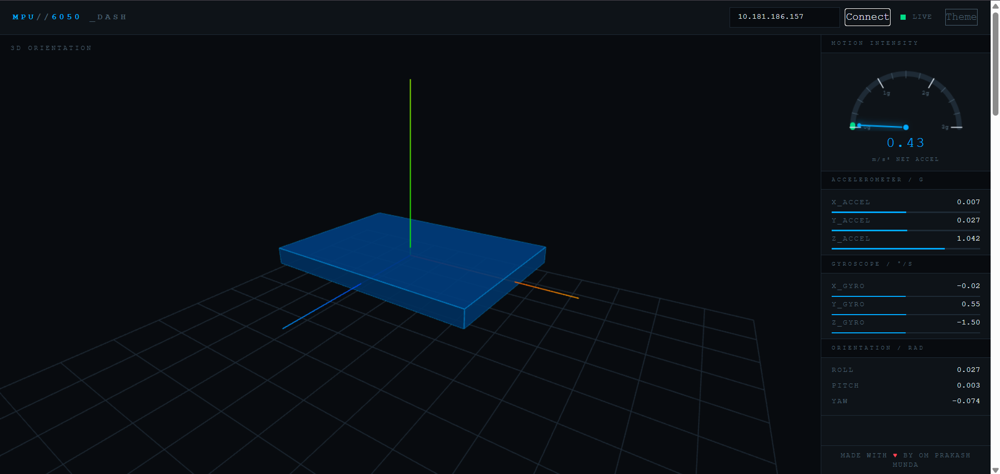
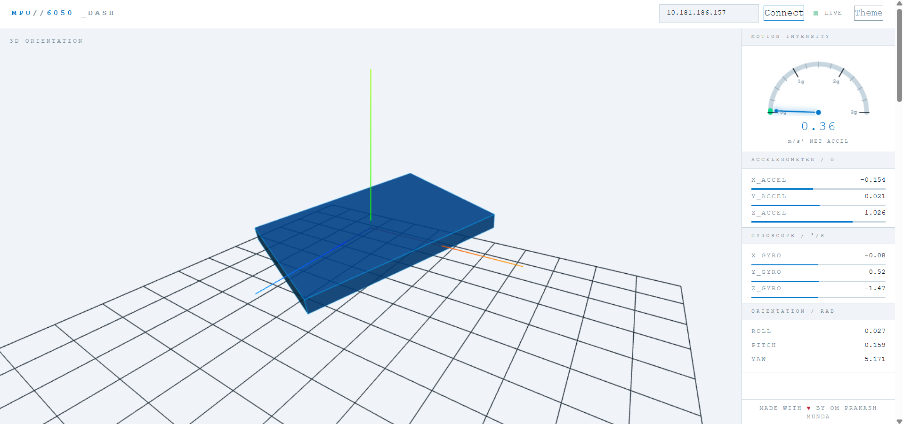
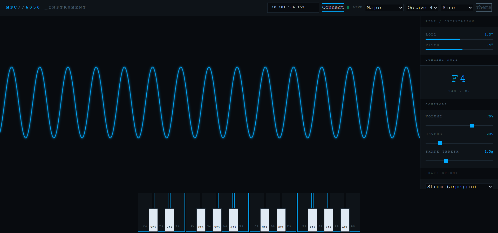

# MPU6050 Live Dashboard

A real-time web dashboard for visualizing MPU6050 IMU data streamed from an ESP8266 over WebSocket.
Features a live 3D orientation model, motion intensity gauge, raw sensor readings, and a tilt-controlled
musical instrument — all in single HTML files with zero dependencies to install.

---

## Screenshots

### Dashboard



### Instrument


---

## Features

### Dashboard (`dashboard/index.html`)
- **3D Orientation** — Live Three.js board model rotates with the physical sensor
- **Motion Gauge** — Canvas-drawn speedometer showing net acceleration in m/s²
- **Raw Data Panel** — Accelerometer (g), Gyroscope (°/s), and computed Roll/Pitch/Yaw
- **IP Input** — Connect to any ESP8266 directly from the browser
- **Theme Switch** — Dark / Light mode
- **No backend needed** — Browser connects directly to ESP8266 WebSocket
- **Built-in Documentation** — Full math and wiring reference scrollable below the dashboard

### Instrument (`instrument/index.html`)
- **Tilt → Note** — Roll axis maps across a musical scale in real time
- **Pitch → Octave** — Tilt forward/back to shift an octave up or down
- **Shake → Effects** — Strum, Drum hit, Glitch burst, or Full chord on shake
- **Scale Selector** — Major, Minor, Pentatonic, Blues, Chromatic
- **Waveform Selector** — Sine, Triangle, Sawtooth, Square
- **Volume + Reverb** — Adjustable sliders
- **Shake Threshold** — Tune sensitivity of shake detection
- **Live Waveform Visualizer** — Canvas oscilloscope of the audio output
- **Clickable Piano Keyboard** — Scale notes highlighted, playable by mouse

---

## Hardware Required

| Component | Details |
|-----------|---------|
| ESP8266 | NodeMCU v1/v2 or any variant |
| MPU6050 | GY-521 module |
| Jumper wires | 4x |

### Wiring

```
MPU6050 Pin  →  ESP8266 (NodeMCU)
──────────────────────────────────
VCC          →  3.3V
GND          →  GND
SDA          →  D2  (GPIO 4)
SCL          →  D1  (GPIO 5)
AD0          →  GND (I²C address 0x68)
```

---

## Arduino Setup

### Libraries Required

Install via **Arduino IDE → Sketch → Manage Libraries**:

| Library | Author |
|---------|--------|
| `MPU6050` | Electronic Cats |
| `WebSockets` | Markus Sattler |
| `ArduinoJson` | Benoit Blanchon |

> ⚠️ Install **WebSockets** by Markus Sattler — not "ArduinoWebsockets" by Gil Maimon. They are different libraries.

### Flash the ESP8266

1. Open `firmware/firmware.ino` in Arduino IDE
2. Set your WiFi credentials:
   ```cpp
   const char* ssid     = "YOUR_SSID";
   const char* password = "YOUR_PASSWORD";
   ```
3. Select board: **Tools → Board → NodeMCU 1.0 (ESP-12E Module)**
4. Upload and open Serial Monitor at **115200 baud**
5. Note the IP address printed on boot

---

## Usage

### Dashboard
1. Open `dashboard/index.html` in any modern browser
2. Enter the ESP8266 IP address in the input field
3. Click **Connect** — status dot turns green
4. Tilt and move the sensor to see the 3D model respond live
5. Scroll down for full documentation

### Instrument
1. Open `instrument/index.html` in any modern browser
2. Enter the ESP8266 IP and click **Connect**
3. Click anywhere on the page first to unlock browser audio
4. **Tilt left/right** to change notes across the scale
5. **Tilt forward/back** beyond 30° to shift an octave
6. **Shake** the sensor to trigger the selected effect
7. Use the piano keyboard at the bottom to play manually

> Both devices must be on the **same WiFi network.**

---

## How It Works

### Complementary Filter (Orientation)

```
roll  = 0.96 × (roll  + gx × dt × π/180) + 0.04 × atan2(ay, az)
pitch = 0.96 × (pitch + gy × dt × π/180) + 0.04 × atan2(-ax, √(ay²+az²))
yaw  += gz × dt × π/180
```

### Motion Gauge / Shake Detection

```
magnitude = √(ax² + ay² + az²)
net_g     = |magnitude − 1.0|       ← subtract gravity
net_ms²   = net_g × 9.81
smoothG   = 0.8 × prev + 0.2 × net_g
```

### Tilt → Note Mapping

```
roll range: -90° to +90°  →  maps to scale index 0..N
fraction  = (roll + 90) / 180
noteIndex = floor(fraction × scale.length)
midi      = rootNote + scale[noteIndex] + octaveShift
frequency = 440 × 2^((midi - 69) / 12)
```

### Data Format (ESP → Browser)

```json
{ "ax": 0.012, "ay": -0.004, "az": 0.998,
  "gx": 0.31,  "gy": -0.12,  "gz": 0.08 }
```
Streamed over WebSocket at ~20Hz (port 81).

---

## Project Structure

```
mpu6050-live-dashboard/
├── firmware/
│   └── firmware.ino            # ESP8266 Arduino sketch
├── dashboard/
│   └── index.html              # 3D orientation dashboard
├── instrument/
│   └── index.html              # Tilt-controlled instrument
├── screenshots/
│   ├── dashboard-dark.png
│   ├── dashboard-light.png
│   └── instrument.png
└── README.md
```

---

## Known Limitations

- **Yaw drifts** over time — no magnetometer reference. Use MPU9250 for drift-free yaw.
- **Absolute speed** cannot be derived reliably from accelerometer alone (integration drift).
- Requires both devices on the same local network (no remote access by default).
- Browser audio requires a user gesture before it unlocks (click anywhere first).

---

## Built With

- [Three.js](https://threejs.org/) — 3D rendering
- [Tailwind CSS](https://tailwindcss.com/) — Utility styling
- [Web Audio API](https://developer.mozilla.org/en-US/docs/Web/API/Web_Audio_API) — Sound synthesis
- [ArduinoJson](https://arduinojson.org/) — JSON on ESP8266
- [WebSockets](https://github.com/Links2004/arduinoWebSockets) — WebSocket server on ESP8266

---

## License

MIT — free to use, modify, and distribute.

---

<p align="center">Made with ❤️ by Om Prakash Munda</p>
